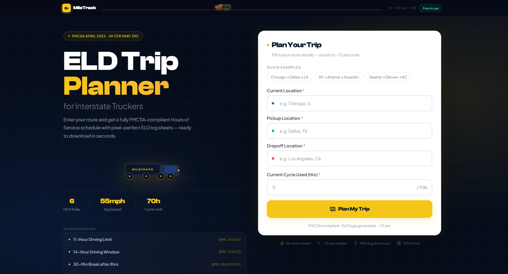
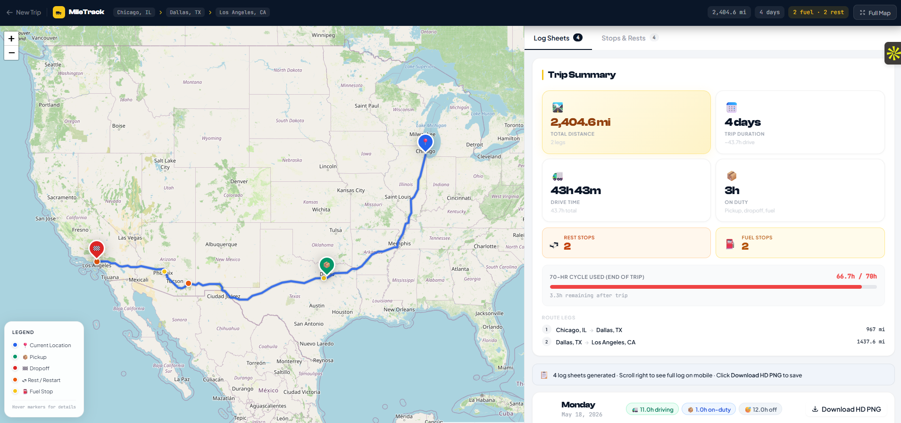
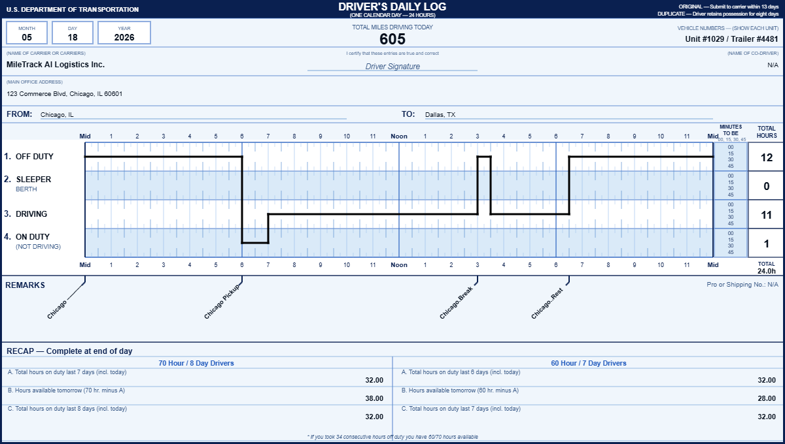
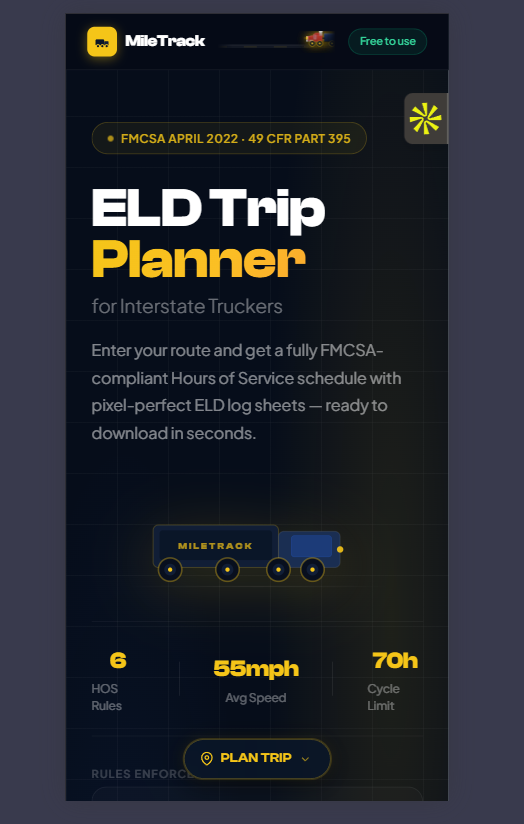
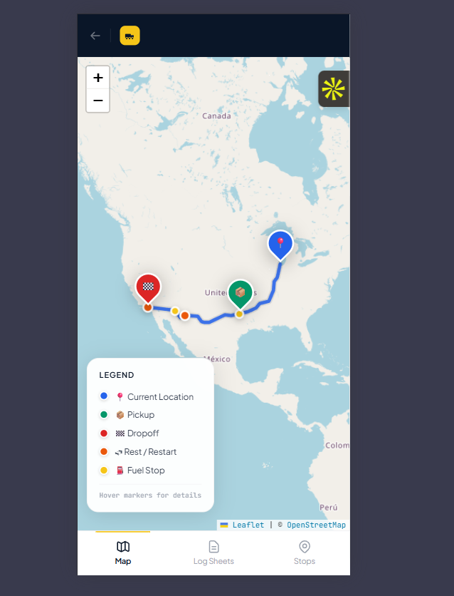

<div align="center">

# MileTrack ELD

### FMCSA-Compliant Interstate Trip Planner & ELD Log Generator

[](https://miletrack-eld.vercel.app/)
[](https://www.loom.com/share/7dd7ce9d981e4f778e778c761c6e22bc)
[](https://github.com/Aayush-engineer/miletrack-eld)

**Django 4.2 · React 18 · Leaflet.js · HTML5 Canvas · OpenStreetMap · OSRM**

</div>

---

## 📸 Screenshots

### Homepage



### Results — Interactive Route Map



### ELD Driver's Daily Log Sheet



### Mobile View





---

## 🎬 Video Walkthrough

[](https://www.loom.com/share/7dd7ce9d981e4f778e778c761c6e22bc)

> *Click the image above to watch the 3–5 minute walkthrough*

---

## 🌐 Live Demo

**Hosted at:** [https://miletrack-eld.vercel.app](https://miletrack-eld.vercel.app/)

- **Frontend** → Vercel (free tier, auto-deploys from GitHub)
- **Backend** → Render.com (free tier)

> ⚠️ Render free tier sleeps after 15 minutes of inactivity. The first API request after idle takes ~30 seconds to wake up. Subsequent requests are fast.

---

## 📋 Table of Contents

- [Overview](#-overview)
- [Features](#-features)
- [Tech Stack](#-tech-stack)
- [HOS Rules Implemented](#-hos-rules-implemented)
- [Architecture](#-architecture)
- [Project Structure](#-project-structure)
- [Local Setup](#-local-setup)
- [Environment Variables](#-environment-variables)
- [API Reference](#-api-reference)
- [Deployment](#-deployment)
- [Testing](#-testing)
- [Design Decisions](#-design-decisions)
- [Known Limitations](#-known-limitations)

---

## 🧭 Overview

**MileTrack ELD** is a full-stack web application that helps interstate truck drivers plan FMCSA-compliant trips. The driver enters their current location, pickup, dropoff, and current cycle hours — and the system automatically:

1. **Geocodes** all three locations using Nominatim (OpenStreetMap)
2. **Calculates the optimal route** using the OSRM public routing API
3. **Simulates a full HOS schedule** enforcing all 6 FMCSA rules simultaneously
4. **Renders an interactive map** showing the route, rest stops, and fuel stops
5. **Generates pixel-perfect ELD log sheets** (one per 24-hour period) matching the official FMCSA Driver's Daily Log format — downloadable as PNG

**Zero API keys required.** Built entirely on free, open-source APIs.

---

## ✨ Features

| Feature | Details |
|---|---|
| 🗺️ **Interactive Route Map** | Leaflet.js + OpenStreetMap tiles with teardrop pin markers, hover tooltips, and rich popups |
| 📋 **ELD Log Sheets** | HTML5 Canvas — pixel-perfect FMCSA Driver's Daily Log, one per day |
| ⬇️ **Download as PNG** | Save any log sheet instantly with one click |
| ⏱️ **Full HOS Simulation** | All 6 FMCSA rules enforced simultaneously in a single Python class |
| ⛽ **Fuel Stops** | Automatically inserted every 1,000 miles (30 min on-duty not driving) |
| 📦 **Pickup / Dropoff** | 1 hour on-duty not driving at each location |
| 🔄 **34-Hour Restart** | Automatically triggered when 70-hour cycle is exhausted |
| 🔍 **Location Autocomplete** | Live Nominatim suggestions as you type — keyboard navigable |
| 📱 **Mobile Responsive** | Full bottom-tab navigation on phones (Map / Log Sheets / Stops) |
| 🌙 **Loading Spinner** | Animated step-by-step progress overlay during API call |
| 🎨 **Premium Design** | Clash Display + Plus Jakarta Sans fonts, animated truck, hero grid |

---

## 🛠 Tech Stack

### Backend

| Technology | Version | Purpose |
|---|---|---|
| Python | 3.11+ | Runtime |
| Django | 4.2.11 | Web framework |
| Django REST Framework | 3.15.1 | API layer |
| django-cors-headers | 4.3.1 | CORS handling |
| requests | 2.31.0 | External API calls (Nominatim, OSRM) |
| gunicorn | 21.2.0 | Production WSGI server |
| whitenoise | 6.6.0 | Static file serving |
| SQLite | — | Development database |
| PostgreSQL | — | Production-ready (via DATABASE_URL) |

### Frontend

| Technology | Version | Purpose |
|---|---|---|
| React | 18.2 | UI framework |
| Vite | 5.1 | Build tool & dev server |
| TailwindCSS | 3.4 | Utility-first styling |
| Leaflet.js | 1.9.4 | Interactive maps |
| react-leaflet | 4.2.1 | React bindings for Leaflet |
| axios | 1.6.7 | HTTP client |
| react-router-dom | 6.22 | Client-side routing |

### External APIs (all free, no API key)

| API | Purpose | Rate Limit |
|---|---|---|
| [Nominatim](https://nominatim.openstreetmap.org) | Geocoding + autocomplete | 1 req/sec |
| [OSRM](http://router.project-osrm.org) | Route calculation + encoded polyline | None |
| [OpenStreetMap](https://www.openstreetmap.org) | Map tiles | Fair use |

### Fonts

| Font | Source | Usage |
|---|---|---|
| Clash Display | [Fontshare](https://www.fontshare.com) | Headlines, numbers, nav |
| Plus Jakarta Sans | Google Fonts | Body text, labels, UI |
| JetBrains Mono | Google Fonts | Numbers, codes, times |

---

## ⏱ HOS Rules Implemented

All rules from **49 CFR Part 395**, April 2022 FMCSA Interstate Driver's Guide to Hours of Service:

| # | Rule | Regulation | Description |
|---|---|---|---|
| 1 | **11-Hour Driving Limit** | §395.3(a)(3) | Max 11 hours driving after 10 consecutive hours off duty. Once reached, must take 10 hours off before driving again. |
| 2 | **14-Hour Driving Window** | §395.3(a)(2) | All driving must occur within a 14-hour window from when on-duty begins. Off-duty time does **not** pause the clock. |
| 3 | **30-Minute Rest Break** | §395.3(a)(3)(ii) | Required after 8 cumulative hours of driving since the last 30-minute consecutive break. |
| 4 | **70-Hour / 8-Day Cycle** | §395.3(b) | Cannot drive after accumulating 70 hours on-duty in any rolling 8-day period. |
| 5 | **34-Hour Restart** | §395.3(c)(1) | Optional: 34+ consecutive off-duty hours fully resets the 70-hour cycle clock. Automatically applied when cycle is exhausted. |
| 6 | **10-Hour Off-Duty Reset** | §395.3(a) | After hitting the 11-hr limit or 14-hr window, must take 10 consecutive hours off duty before driving again. |
| — | **Fuel Stop / 1,000 mi** | Operational | 30-minute on-duty not driving stop inserted every 1,000 miles driven. |
| — | **Pickup / Dropoff** | Operational | 1 hour on-duty not driving at each location. |

**Hard-coded assumptions** (per assessment spec):
- Property-carrying driver, interstate commerce
- 70-hour/8-day cycle (not 60/7)
- No adverse driving conditions exception
- No sleeper berth splits — simple 10-hour off-duty blocks
- Average speed: **55 mph**
- Trip starts at **06:00** after a fresh 10-hour off-duty period

---

## 🏗 Architecture

```
┌─────────────────────────────────────────────────────────────────┐
│                        FRONTEND (Vercel)                        │
│  React 18 + Vite + TailwindCSS                                  │
│                                                                 │
│  ┌──────────────┐  ┌──────────────┐  ┌────────────────────────┐ │
│  │  HomePage    │  │  ResultsPage │  │  LogSheet (Canvas)     │ │
│  │  TripForm    │  │  RouteMap    │  │  FMCSA grid drawing    │ │
│  │  Autocomplete│  │  StopsList   │  │  24-hr duty status     │ │
│  └──────────────┘  └──────────────┘  └────────────────────────┘ │
└────────────────────────┬────────────────────────────────────────┘
                         │ POST /api/trip/plan/
                         │ (JSON: locations + cycle hours)
┌────────────────────────▼────────────────────────────────────────┐
│                        BACKEND (Render)                         │
│  Django 4.2 + DRF                                               │
│                                                                 │
│  TripPlanView                                                   │
│       │                                                         │
│       ├─► geocoding.py ──────────────► Nominatim API            │
│       │   (3 locations, rate-limited)   (OpenStreetMap)         │
│       │                                                         │
│       ├─► routing.py ───────────────► OSRM Public API           │
│       │   (decode polyline,            (router.project-osrm.org)│
│       │    interpolate stop coords)                             │
│       │                                                         │
│       └─► hos_calculator.py                                     │
│           HOSCalculator class                                   │
│           - Simulates trip minute by minute                     │
│           - Enforces all 6 HOS rules simultaneously             │
│           - Returns DayLog objects (segments, totals, remarks)  │
└─────────────────────────────────────────────────────────────────┘
```

### HOS Calculator Design

The `HOSCalculator` class in `backend/trip/services/hos_calculator.py` is the core engine. It simulates the trip segment by segment, maintaining state:

```python
state = {
    current_time,           # datetime — advances as events are added
    hours_driven_this_shift,# resets after 10-hr off-duty
    hours_since_last_break, # resets after 30-min break
    window_start_time,      # 14-hr clock — resets after 10-hr off-duty
    cycle_hours_used,       # rolling total — resets after 34-hr restart
    miles_since_last_fuel,  # resets after fuel stop
}
```

For each mile driven, it checks (in priority order):
1. 30-min break needed? → insert break
2. 70-hr cycle exhausted? → insert 34-hr restart
3. Available drive time before next constraint
4. Fuel stop due? → insert 30-min on-duty stop
5. Drive the available miles → record segment

---

## 📁 Project Structure

```
miletrack-eld/
│
├── docs/
│   └── screenshots/                  
│       ├── homepage.png
│       ├── results-map.png
│       ├── log-sheet.png
│       └── mobile.png
│
├── backend/
│   ├── manage.py
│   ├── requirements.txt
│   ├── Procfile                       
│   ├── .env.example
│   │
│   ├── backend/
│   │   ├── settings/
│   │   │   ├── base.py                
│   │   │   ├── development.py         
│   │   │   └── production.py          
│   │   ├── urls.py
│   │   └── wsgi.py
│   │
│   └── trip/
│       ├── views.py                   
│       ├── serializers.py            
│       ├── models.py                  
│       ├── urls.py
│       │
│       ├── services/
│       │   ├── geocoding.py           
│       │   ├── routing.py            
│       │   └── hos_calculator.py      
│       │
│       └── tests/
│           ├── test_hos_calculator.py 
│           └── test_views.py          
│
└── frontend/
    ├── vercel.json                    
    ├── vite.config.js
    ├── tailwind.config.js
    ├── postcss.config.js
    ├── package.json
    ├── index.html
    ├── .env.example
    │
    └── src/
        ├── index.css                  
        ├── main.jsx
        ├── App.jsx                    
        │
        ├── api/
        │   └── tripApi.js             
        │
        ├── components/
        │   ├── LocationAutocomplete.jsx 
        │   ├── TripForm.jsx            
        │   ├── LoadingSpinner.jsx      
        │   ├── RouteMap.jsx            
        │   ├── LogSheet.jsx            
        │   ├── LogSheetList.jsx        
        │   ├── TripSummary.jsx         
        │   └── StopsList.jsx           
        │
        ├── pages/
        │   ├── HomePage.jsx            
        │   └── ResultsPage.jsx         
        │
        └── utils/
            ├── timeHelpers.js          
            └── logDrawing.js           
```

---

## 🚀 Local Setup

### Prerequisites

- **Python 3.11+**
- **Node.js 18+**
- **Git**

### 1. Clone the repository

```bash
git clone https://github.com/YOUR_USERNAME/miletrack-eld.git
cd miletrack-eld
```

### 2. Backend setup

```bash
cd backend

# Create and activate virtual environment
python -m venv venv
source venv/bin/activate        # Mac/Linux
venv\Scripts\activate           # Windows PowerShell

# Install dependencies
pip install -r requirements.txt

# Set up environment
cp .env.example .env
# Open .env and paste a generated secret key:
python -c "import secrets; print(secrets.token_urlsafe(50))"

# Create the database
python manage.py migrate

# Start backend
python manage.py runserver
# → Running at http://localhost:8000
```

### 3. Frontend setup

Open a **new terminal**:

```bash
cd frontend

# Install packages
npm install

# Set up environment
cp .env.example .env.local
# .env.local already contains: VITE_API_URL=http://localhost:8000

# Start dev server
npm run dev
# → Running at http://localhost:5173
```

### 4. Open the app

Visit **http://localhost:5173** in your browser.

Click **"Chicago → Dallas → LA"** quick example, then click **Plan My Trip**.

---

## 🔐 Environment Variables

### Backend — `backend/.env`

```env
# Generate with: python -c "import secrets; print(secrets.token_urlsafe(50))"
DJANGO_SECRET_KEY=your-secret-key-here

# Use development settings locally
DJANGO_SETTINGS_MODULE=backend.settings.development

# Allowed hosts for local dev
ALLOWED_HOSTS=localhost,127.0.0.1

# Allow requests from the Vite dev server
CORS_ALLOWED_ORIGINS=http://localhost:5173

# Leave blank for local SQLite (PostgreSQL URL for production)
DATABASE_URL=
```

### Frontend — `frontend/.env.local`

```env
# Points to your local Django backend
VITE_API_URL=http://localhost:8000
```

### Production environment variables (set in dashboards)

**Render (backend):**

| Variable | Value |
|---|---|
| `DJANGO_SETTINGS_MODULE` | `backend.settings.production` |
| `DJANGO_SECRET_KEY` | Generated secret key |
| `ALLOWED_HOSTS` | `your-app.onrender.com` |
| `CORS_ALLOWED_ORIGINS` | `https://miletrack-eld.vercel.app` |

**Vercel (frontend):**

| Variable | Value |
|---|---|
| `VITE_API_URL` | `https://your-app.onrender.com` |

---

## 📡 API Reference

### `POST /api/trip/plan/`

Plans a complete trip with HOS-compliant schedule and ELD log sheets.

**Request body:**

```json
{
  "current_location": "Chicago, IL",
  "pickup_location": "Dallas, TX",
  "dropoff_location": "Los Angeles, CA",
  "current_cycle_used": 20.0
}
```

| Field | Type | Validation | Description |
|---|---|---|---|
| `current_location` | string | Required | Driver's current city/state |
| `pickup_location` | string | Required | Pickup city/state |
| `dropoff_location` | string | Required, ≠ pickup | Dropoff city/state |
| `current_cycle_used` | float | 0.0 – 70.0 | Hours used in current 8-day cycle |

**Response:**

```json
{
  "route": {
    "total_distance_miles": 2404.6,
    "total_estimated_hours": 43.7,
    "legs": [
      { "from": "Chicago, IL", "to": "Dallas, TX", "distance_miles": 967.0, "drive_time_hours": 17.6 },
      { "from": "Dallas, TX",  "to": "Los Angeles, CA", "distance_miles": 1437.6, "drive_time_hours": 26.1 }
    ],
    "waypoints": [
      { "name": "Chicago, IL",      "lat": 41.878, "lng": -87.630, "type": "start"   },
      { "name": "Dallas, TX",       "lat": 32.776, "lng": -96.797, "type": "pickup"  },
      { "name": "Los Angeles, CA",  "lat": 34.052, "lng": -118.244,"type": "dropoff" }
    ],
    "stops": [
      { "type": "fuel", "lat": 36.1, "lng": -95.9, "arrival_time": "2026-05-15T17:00:00", "duration_minutes": 30 },
      { "type": "rest", "lat": 35.2, "lng": -97.5, "arrival_time": "2026-05-15T21:00:00", "duration_minutes": 600 }
    ],
    "polyline": [[41.878, -87.630], [39.1, -93.4], ...]
  },
  "daily_logs": [
    {
      "day": 1,
      "date": "2026-05-15",
      "from_location": "Chicago, IL",
      "to_location": "En Route: Chicago, IL → Dallas, TX",
      "total_miles_today": 605.0,
      "segments": [
        { "status": "off_duty",            "start": "00:00", "end": "06:00", "location": "Chicago, IL",          "duration_hours": 6.0  },
        { "status": "on_duty_not_driving", "start": "06:00", "end": "07:00", "location": "Chicago, IL — Pickup", "duration_hours": 1.0  },
        { "status": "driving",             "start": "07:00", "end": "18:00", "location": "En Route: ...",        "duration_hours": 11.0 },
        { "status": "off_duty",            "start": "18:00", "end": "24:00", "location": "Chicago, IL",          "duration_hours": 6.0  }
      ],
      "total_hours": {
        "off_duty": 12.0, "sleeper_berth": 0.0, "driving": 11.0, "on_duty_not_driving": 1.0
      },
      "remarks": [
        "06:00 - On Duty (Not Driving) - Chicago, IL — Pickup",
        "07:00 - Driving - En Route: Chicago, IL → Dallas, TX",
        "18:00 - Off Duty - Chicago, IL"
      ],
      "cycle_hours_at_end_of_day": 32.0
    }
  ]
}
```

**Error responses:**

| Status | Meaning |
|---|---|
| `400` | Invalid request data (missing fields, cycle hours out of range) |
| `422` | Geocoding failed (location not found) |
| `503` | External API unavailable (Nominatim or OSRM down) |

---

## ☁️ Deployment

### Backend → Render.com

1. Go to [render.com](https://render.com) → **New Web Service**
2. Connect your GitHub repository
3. Configure:
   - **Root Directory:** `backend`
   - **Build Command:** `pip install -r requirements.txt && python manage.py migrate`
   - **Start Command:** `gunicorn backend.wsgi:application`
4. Add environment variables (see table above)
5. Click **Deploy** — takes ~3 minutes first time

### Frontend → Vercel

1. Go to [vercel.com](https://vercel.com) → **Add New Project**
2. Import from GitHub
3. Configure:
   - **Root Directory:** `frontend`
   - **Build Command:** `npm run build`
   - **Output Directory:** `dist`
4. Add environment variable: `VITE_API_URL=https://your-app.onrender.com`
5. Click **Deploy** — ~1 minute

The `vercel.json` in the frontend folder handles:
- SPA routing (all paths → `index.html`)
- Content Security Policy headers (allows Google Fonts, Fontshare)
- Static asset caching (1 year for hashed assets)

---

## 🧪 Testing

```bash
cd backend
source venv/bin/activate    # Windows: venv\Scripts\activate

# Run all tests
python manage.py test trip.tests -v 2

# HOS logic tests only (14 tests)
python manage.py test trip.tests.test_hos_calculator -v 2

# API endpoint tests only (6 tests)
python manage.py test trip.tests.test_views -v 2
```

**Expected output: 20 tests, 0 failures**

### What the tests cover

| Test Class | Tests | What it verifies |
|---|---|---|
| `Test30MinBreakInsertion` | 3 | Break fires after 8h, resets counter, not needed under 8h |
| `Test11HourDrivingLimit` | 3 | Cap enforced per shift, 10-hr rest inserted, multi-day compliance |
| `Test14HourWindowEnforcement` | 1 | All driving within 14-hr window from on-duty start |
| `Test70HourCycleLimit` | 3 | Never exceeds 70h, 34-hr restart fires, cycle resets correctly |
| `TestMultiDayTripEndToEnd` | 4 | Chicago→Dallas→LA structure, fuel stops, pickup/dropoff events, drive time accuracy |
| `TripPlanViewTests` | 6 | 400 on missing fields, 422 on geocoding failure, 200 with correct response structure |

---

## 🎨 Design Decisions

### Why Nominatim over Google Maps?
The assessment specified **no API keys**. Nominatim is OSM's official geocoding API — free, no key required, and accurate for US cities. We add a 1.1-second rate limit between requests (per Nominatim ToS) and a proper `User-Agent` header.

### Why OSRM over other routers?
OSRM's public demo server (`router.project-osrm.org`) is free with no key. It returns distance, and an encoded polyline we decode with our own implementation of the Google polyline algorithm. We use **55 mph fixed** instead of OSRM's duration estimate (per spec).

### Why HTML5 Canvas for log sheets?
Canvas gives pixel-perfect control over every element — exactly matching the FMCSA official format. Libraries like jsPDF or React PDF would add dependencies and lose precision. The `document.fonts.ready` API ensures fonts load before drawing.

### Why plain CSS variables + inline styles for some components?
Tailwind's `@apply` directive can't resolve custom color names at build time, causing PostCSS errors. For components that use custom brand colors (`#0a1628`, `#f5c518`), we use inline styles or CSS variables — guaranteed to work on both localhost and Vercel.

### HOSCalculator architecture
A single Python class with clear state tracking. All HOS rules are checked **simultaneously** for every mile driven — not sequentially. This prevents edge cases like hitting the 14-hour window and 30-minute break simultaneously.

---

## ⚠️ Known Limitations

| Limitation | Explanation |
|---|---|
| **Fixed 55 mph** | No traffic, terrain, or weather adjustment. OSRM durations are ignored per spec. |
| **US cities only** | Nominatim autocomplete is filtered to `countrycodes=us` for the trucking context. |
| **Nominatim rate limit** | 3 location geocodes = ~3.3 seconds just for geocoding (1.1s per request). |
| **Render cold starts** | Free tier sleeps after 15 min idle. First request after sleep = ~30 seconds. |
| **No sleeper berth splits** | Uses simple 10-hour off-duty blocks. §395.1(g) splits are not implemented. |
| **No 34-hr restart restrictions** | The 34-hr restart in §395.3(c)(2) (requiring two consecutive 1–5 AM periods) is not enforced. |
| **Average speed only** | Real-world routes vary. The 55 mph assumption can under- or over-estimate drive time. |

---

## 📜 License

MIT — free for personal and commercial use.

---

## ⚠️ Disclaimer

This tool is for **trip planning purposes only**. Always verify Hours of Service compliance with your carrier, safety officer, and the official FMCSA regulations at [fmcsa.dot.gov](https://www.fmcsa.dot.gov). The developers assume no liability for any regulatory violations.

---

<div align="center">

**Built with Django + React · No API keys · Fully open source**

[🚛 Live Demo](https://miletrack-eld.vercel.app) · [🎬 Watch Walkthrough](https://www.loom.com/share/YOUR-LOOM-ID) · [📧 Contact](mailto:your@email.com)

</div>